<h1 align="center">Compose Multiplatform Library Template</h1>

<p align="center">
  
  
</p>

<p align="center">
  <a href="https://github.com/aryapreetam/cmp-lib-template/actions/workflows/release.yml">
    
  </a>
  <a href="https://mvnrepository.com/artifact/io.github.aryapreetam/fiblib">
    
  </a>
  <a href="https://github.com/aryapreetam/cmp-lib-template/blob/main/LICENSE">
    
  </a>
</p>

<p align="center">
  
  
  
  
</p>

<!-- New: Brief template description -->
This repository is a ready-to-ship template for building and releasing Compose Multiplatform libraries. It automates the heavy lifting so you can focus on your API and UX:

- Turns your README into a library homepage and publishes it via GitHub Pages (rendered using Docsify).
- Builds and deploys a wasm demo to `/demo` so users can try your library in the browser.
- Generates and publishes API docs (Dokka) to `/api`.
- Produces downloadable sample app executables (APK, DMG, iOS Simulator zip, wasm bundle) so users can validate the library on their device/emulator quickly.
- Wires a complete CI/CD: test → package → GitHub Release → Pages deploy → optional Maven Central publish on tags.

Wasm Demo: 
[](https://aryapreetam.github.io/cmp-lib-template/demo/)

API Docs:
[](https://aryapreetam.github.io/cmp-lib-template/api/)

---

## 🛠️ Using This Template

**New to this template?** Check out the complete guide: [📖 Using This Template for Your Library](docs/using-this-template.md)

**Quick setup:**
1. Click "Use this template" to create your repo
2. Follow the [setup guide](docs/using-this-template.md) to customize for your library
3. Configure [GitHub secrets](docs/github-secrets-setup.md) for publishing
4. **Enable GitHub Pages:** Go to repository Settings → Pages → Source: Select "GitHub Actions"
5. Start coding your library!

> **Note:** You don't need a pre-existing `<username>.github.io` site. GitHub Pages will automatically create `https://<username>.github.io/<your-library-name>/` when you run your first release.

**For contributors:** See [CONTRIBUTING.md](CONTRIBUTING.md) for development guidelines.

---

## Quick Start

Add the dependency to your Kotlin Multiplatform library or app. Replace coordinates with your published group/artifact.

Option A — Version catalog (recommended)

1) In `gradle/libs.versions.toml`:

```toml
yourlib = "0.1.0"

[libraries]
yourlib = { module = "io.github.yourorg:your-lib", version.ref = "yourlib" }
```

2) In your module's `build.gradle.kts`:

```kotlin
kotlin {
  sourceSets {
    val commonMain by getting {
      dependencies {
        implementation(libs.yourlib)
      }
    }
  }
}
```

Option B — Hardcoded dependency (direct version)
[versions]

```kotlin
kotlin {
  sourceSets {
    val commonMain by getting {
        // From Maven Central release
        // implementation("io.github.yourorg:your-lib:0.1.0-SNAPSHOT")
      }
    }
  }
}
```

If using snapshots from Maven Local, ensure:

```kotlin
repositories {
  mavenLocal()
  mavenCentral()
}
```

Minimal usage example:

```kotlin
import fiblib.getFibonacciNumbers

val first10 = getFibonacciNumbers(10)
println(first10)
```

---

## 📦 Download Sample App Executables

Download and try the sample app on your platform without building from source:

| Platform | Download Link |
|----------|--------------|
| 🍏 **macOS (Intel)** | [](https://github.com/aryapreetam/cmp-lib-template/releases/latest/download/sample-app-desktop-x64.dmg) |
| 🍎 **macOS (Apple Silicon)** | [](https://github.com/aryapreetam/cmp-lib-template/releases/latest/download/sample-app-desktop-arm64.dmg) |
| 🪟 **Windows** | [](https://github.com/aryapreetam/cmp-lib-template/releases/latest/download/sample-app-windows.msi) |
| 🤖 **Android** | [](https://github.com/aryapreetam/cmp-lib-template/releases/latest/download/sample-app-android-unsigned.apk) |
| 🌐 **Web (Wasm)** | [](https://github.com/aryapreetam/cmp-lib-template/releases/latest/download/sample-app-wasm.zip) |
|  **iOS Simulator** | [](https://github.com/aryapreetam/cmp-lib-template/releases/latest/download/sample-app-ios-simulator.zip) |

### How to Run the Sample App

#### 🤖 Android
**Option 1: Drag and Drop**
- Download the APK file
- Open an Android emulator or connect a physical device
- Drag the APK onto the emulator window

**Option 2: ADB Install**
```bash
adb install sample-app-android-unsigned.apk
```

#### 🌐 Web (Wasm)
- Download and unzip `sample-app-wasm.zip`
- Open `index.html` in a web browser

**Note:** You can also try the live demo without downloading: [Try Live Demo](https://aryapreetam.github.io/cmp-lib-template/demo/)

#### 🍏 iOS Simulator
- Download `sample-app-ios-simulator.zip` from the [latest release](https://github.com/aryapreetam/cmp-lib-template/releases)
- Unzip to get `sample-app-ios-simulator.app`
- Open your iOS Simulator in Xcode
- Drag the `.app` onto the Simulator window OR run:
  ```sh
  xcrun simctl install booted /path/to/sample-app-ios-simulator.app
  ```
- The sample app will now appear and can be launched directly from the Simulator!

#### 🍎 macOS
- Download the DMG for your Mac architecture (Intel or Apple Silicon)
- Open (mount) the DMG and drag the app to your Applications folder (or Desktop)
- **When you try to open the app for the first time, you may see a Gatekeeper warning:**

  <p align="center">
    
    <br/>
    <sub>Mac Gatekeeper dialog when opening the app for the first time</sub>
  </p>

- To allow running the app:
     1. **Right-click (control-click) the app and select "Open".**
     2. In the dialog, click "Open". (If there is a question mark in the corner, you can click it for more info.)
     3. The app will start. This is safe for open-source/test builds.

> This is a normal security step for all open-source and CI-generated Mac executables. Apps are signed ad-hoc for internal/dev use, not with a public Apple developer ID.

**Tip:** Unsure about your Mac's type? Click the Apple logo → "About This Mac". If it says Intel, download x64; if it says M1, M2, or M3, download arm64.

#### 🪟 Windows
- Download and run the MSI installer
- Follow the installation wizard
- Launch the app from the Start menu

---

## 🚀 What This Template Provides

This template automatically generates and deploys three key resources for your library:

| Resource | Description | Preview |
|----------|-------------|---------|
| 📚 **Library Homepage** | Your README becomes a beautiful landing page with Docsify |  |
| 📖 **API Documentation** | Automatically generated Dokka docs with improved UI (2.1.0-Beta) |  |
| 🌐 **Live Wasm Demo** | Interactive browser demo of your sample app |  |

All three are automatically deployed to GitHub Pages:
- **Homepage:** `https://<username>.github.io/<library-name>/`
- **API Docs:** `https://<username>.github.io/<library-name>/api/`
- **Demo:** `https://<username>.github.io/<library-name>/demo/`

---

## 🛠️ Run Sample App from Source

You can also run Gradle tasks in the terminal:

* `./gradlew run` to run application
* `./gradlew package` to store native distribution into `build/compose/binaries`

### Run Sample App by Platform

- **Desktop JVM:** `./gradlew :sample:composeApp:run`
- **Android:** Open project in Android Studio and run the sample app
- **iOS:** Open `sample/iosApp/iosApp.xcodeproj` in Xcode and run the sample app
- **Wasm:** `./gradlew :sample:composeApp:wasmJsBrowserRun`

---

## Dokka UI comparison

The API documentation appearance has improved with Dokka 2.1.0-Beta. Below is a quick visual comparison.

| Dokka (2.0.0)                                           | Dokka (2.1.0-Beta)                                    |
|---------------------------------------------------------|-------------------------------------------------------|
|    |  |
|  |  |


## CI/CD overview

This repo ships with an opinionated CI/CD that builds, tests, packages, releases, and deploys docs & demo automatically on tags.

```mermaid
flowchart TD
    A["Lint"] --> B["Build & Test - Library + Sample (all targets)"]
    B --> C["Android UI tests (emulator) & Maestro E2E tests(iOS & Android)"]
    C --> D["Build artifacts - all targets APK • DMG • iOS Simulator zip • wasm bundle"]
    D --> E["Create GitHub Release and upload artifacts"]
    E --> F["Publish to Maven Central"]
    E --> G["Deploy GitHub Pages README site (Docsify) + wasm demo + API docs"]
```



Key points:
- Triggered on version tags (`v*`) and manual runs.
- Lint first, then build/test library targets followed by sample targets.
- Android UI tests on emulator before packaging.
- GitHub Release includes platform artifacts for quick validation.
- GitHub Pages hosts the README homepage (Docsify), wasm demo, and Dokka API docs.

---

### Publish to MavenLocal

1) Run `./gradlew :lib:publishToMavenLocal`
2) Open `~/.m2/repository/fiblib/`

### Publish to MavenCentral

Follow https://www.jetbrains.com/help/kotlin-multiplatform-dev/multiplatform-publish-libraries.html & complete all necessary steps.

The above article focuses on publishing to MavenCentral.
But if you want to verify publishing from your local machine, you can follow below steps:

1) Add these lines to `~/.gradle/gradle.properties`(not to be confused with `gradle.properties` in project root):
   ```
   signing.keyId=XXXXXXXX
   signing.password=[key password]
   signing.secretKeyRingFile=../XXXXXXXX.gpg
   mavenCentralUsername=[generated username]
   mavenCentralPassword=[generated password]
   ```
   For `GPG_KEY_CONTENTS` secret(signing.secretKeyRingFile above), can get plain text version of gpg key using below commands.
   ```
   # This will print the private GPG key in plain text.
   gpg --export-secret-keys --armor <key id>
   
   # this will copy it for pasting in github actions secrets.
   gpg --export-secret-keys --armor <key id> | pbcopy
   ```
2) Run `./gradlew :lib:publishAndReleaseToMavenCentral --no-configuration-cache`
   
Now check the deployments here https://central.sonatype.com/publishing/deployments 


## License

MIT License © 2025 aryapreetam and contributors. See [LICENSE](./LICENSE) for details.

---

## 🙏 Acknowledgments

This template was built with inspiration and learnings from the excellent work of the Kotlin multiplatform community:

- **Project Setup:** Initial project structure was created using [Kotlin Multiplatform Web Wizard](https://terrakok.github.io/kmp-web-wizard/) by [terrakok](https://github.com/terrakok)

- **Inspirations:**
  - [Reorderable](https://github.com/Calvin-LL/Reorderable) by Calvin-LL - For a library that seamlessly works across all platforms, and most importantly, providing demo app APK in releases to test before integrating
  - [compose-multiplatform-library-template](https://github.com/KevinnZou/compose-multiplatform-library-template) by KevinnZou 
  - [compose-multiplatform-library-template](https://github.com/meticha/compose-multiplatform-library-template) by meticha 

Special thanks to:
- **GitHub** for hosting this project and providing free compute resources for CI/CD through GitHub Actions
- **JetBrains** for building the incredible Kotlin Multiplatform and Compose Multiplatform frameworks that enable us to build truly cross-platform applications with shared code
- The entire **Kotlin Multiplatform and Compose Multiplatform communities** for making cross-platform development better every day!

---

## 📋 TBD (To Be Done) - Future Enhancements

This section lists planned improvements and features for the template. Contributions are welcome!

### 🔧 Code Quality & Tooling

- [ ] **Add Detekt** - Static code analysis for Kotlin
  - Configure rules for library code
  - Integrate into CI pipeline
  
- [ ] **Add ktlint** - Kotlin code formatter
  - Consistent code style across project
  - Auto-formatting in CI
  
- [ ] **Add Kover** - Code coverage reporting
  - Track test coverage across platforms
  - Publish coverage reports to Codecov
  
- [ ] **Add Dependabot** - Automated dependency updates
  - Weekly checks for Gradle dependencies
  - Weekly checks for GitHub Actions versions

### 🧪 Testing Enhancements

- [ ] **Screenshot Testing** - Visual regression testing
  - Add Paparazzi for Android
  - iOS screenshot tests using XCTest
  
- [ ] **Performance Benchmarking** - Track performance metrics
  - Integrate androidx.benchmark for Android
  - Baseline profiles for library code

### 📚 Documentation & Examples

- [ ] **Multi-Module Support Guide**
  - Document how to structure multi-module libraries
  - Example with feature modules
  
- [ ] **Compose Resources Guide**
  - How to bundle images, strings, fonts
  - Localization examples
  - Resource packaging best practices
  
- [ ] **Video Tutorial**
  - 10-minute walkthrough of using the template
  - Publishing to Maven Central demo
  - Deploying demo and docs
  
- [ ] **Blog Post / Article**
  - Write comprehensive guide on Dev.to or Medium
  - Share on Reddit r/Kotlin and r/Kotlinmobile

### 🤖 Automation Improvements

- [ ] **Automated Changelog Generation**
  - Use conventional commits
  - Auto-generate release notes from commits/PRs
  - Integrate github-changelog-generator
  
- [ ] **Version Bump Automation**
  - Script to update version in lib/build.gradle.kts
  - Semantic versioning support
  - Consider semantic-release integration
  
- [ ] **Automated Screenshots**
  - Generate sample app screenshots during CI
  - Attach to releases or README

### 🖥️ Platform Support

- [ ] **Linux Desktop Packaging**
  - Add DEB/RPM package generation
  - AppImage support
  
- [ ] **Additional Apple Platforms**
  - watchOS support
  - tvOS support
  - macCatalyst support
  
- [ ] **Desktop Linux Native Build**
  - Build on Linux runners for native Linux apps
  - Better Linux desktop integration

### 🌐 GitHub Pages Enhancements

- [ ] **Custom Domain Support**
  - Document setup for custom domains
  - DNS configuration guide
  
- [ ] **Improved Docsify Theme**
  - Custom theme matching library branding
  - Dark mode support
  - Better mobile responsive design
  
- [ ] **Search Functionality**
  - Add search to documentation site
  - Full-text search across API docs

### 🔐 Security & Best Practices

- [ ] **Vulnerability Scanning**
  - Integrate Snyk or similar
  - Automated security updates
  
- [ ] **SBOM Generation**
  - Generate Software Bill of Materials
  - Dependency transparency
  
- [ ] **Signed Releases**
  - Sign release artifacts with GPG
  - Provide checksums (SHA256)

### 📦 Distribution & Publishing

- [ ] **JitPack Support**
  - Alternative to Maven Central
  - Easier for snapshot builds
  
- [ ] **NPM Package for Wasm**
  - Publish wasm builds to NPM
  - Better integration with web projects
  
- [ ] **CocoaPods Support**
  - Publish iOS framework to CocoaPods
  - Easier iOS integration

### 🎨 Template Features

- [ ] **Template Initialization Script**
  - Interactive CLI to customize template
  - Automated find/replace for package names
  - Git history cleanup

---

### 💡 Have an Idea?

If you have suggestions for improvements or want to contribute:
1. Check if the feature is already listed above
2. Open an issue to discuss your idea
3. Submit a PR with your implementation

**Priority**: Items marked with 🔥 are high priority and would have the most impact.

---

## 🤝 Contributing

See [CONTRIBUTING.md](CONTRIBUTING.md) for detailed contribution guidelines.
